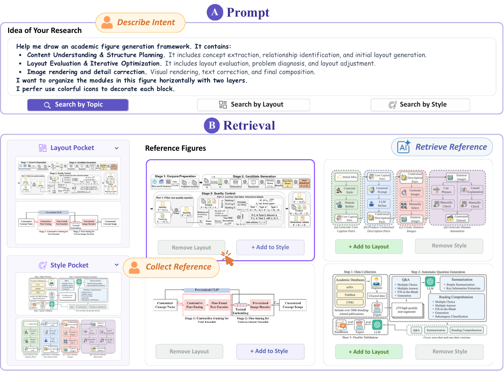
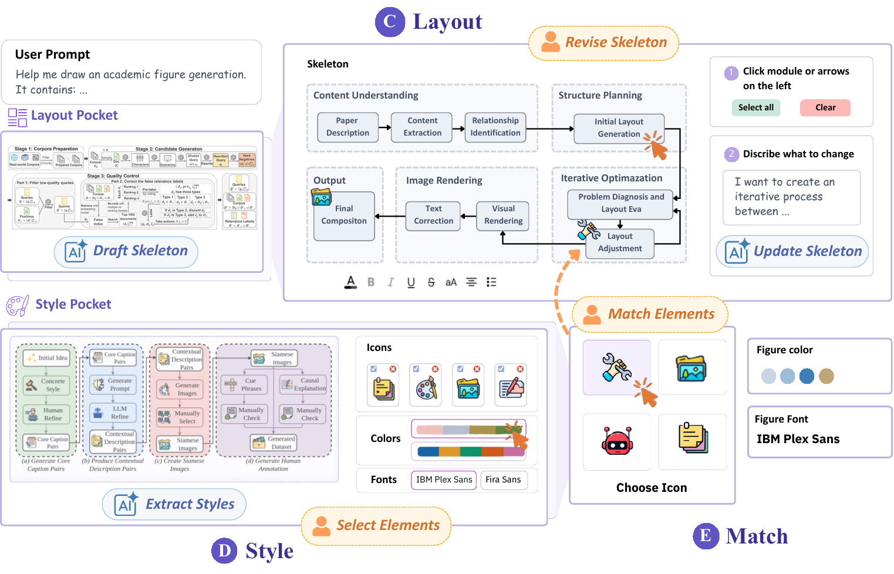
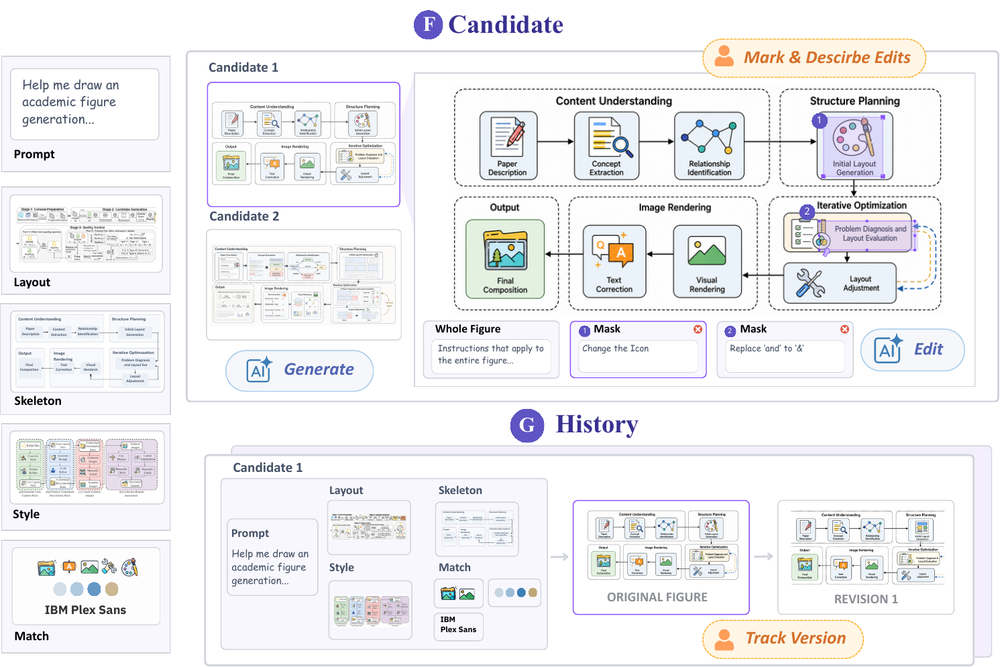
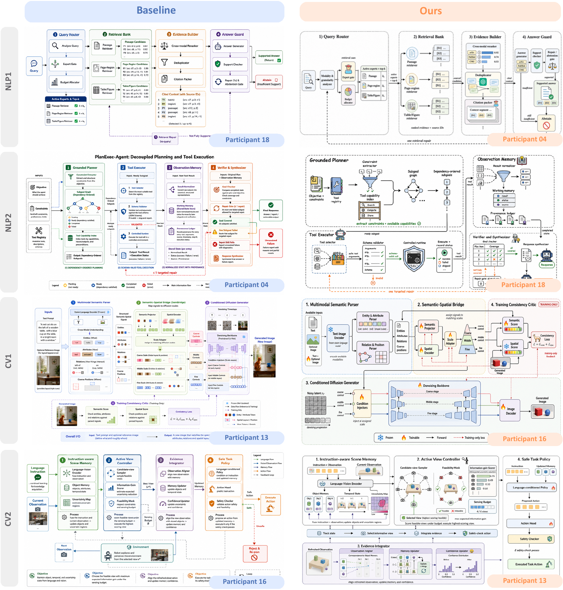

<p align="center">
  
</p>

<h1 align="center">HiFigure</h1>

<p align="center">Create scientific methodology figures from references, editable structure, and iterative generation.</p>

<p align="center">
  <a href="HiFigure_CHI27.pdf"></a>
  <a href="backend/pyproject.toml"></a>
  <a href="https://github.com/figurehi/HiFigure/releases/tag/datasets"></a>
  <a href="LICENSE"></a>
</p>

HiFigure helps researchers turn an idea into an editable figure. Its workflow moves through three stages: **Envision** a visual direction from reference figures, **Externalize** the structure and style, and **Evolve** generated candidates through targeted edits and revision history.

## Workflow

### 1. Envision: find references

Describe your research idea, search by topic, layout, or style, and collect useful figures as references.



### 2. Externalize: shape the figure

Generate and edit a figure skeleton, extract reusable visual elements from a style reference, and assign icons, colors, and typography.



### 3. Evolve: generate and revise

Compare candidates, describe whole-figure or local changes, and revisit earlier versions in the history panel.



## Quick start

Create the environment and local configuration from the repository root:

```bash
conda env create -f environment.yml
conda activate hifigure
cp backend/.env.example backend/.env
cp frontend/.env.example frontend/.env.local
```

Set these values in `backend/.env` for the full generation and retrieval workflow. The example file already points the model base URLs to the OpenAI API; change the corresponding `*_BASE_URL` values if you use compatible endpoints.

```dotenv
TEXT_MODEL_API_KEY=your_chat_api_key
TEXT_MODEL_NAME=your_chat_model
IMAGE_MODEL_API_KEY=your_image_api_key
IMAGE_MODEL_NAME=your_image_model
RETRIEVAL_MODEL_API_KEY=your_responses_api_key
RETRIEVAL_MODEL_NAME=your_responses_model
```

The text model needs a chat-compatible endpoint, the image model needs a transport supported by `backend/app/image_client.py`, and retrieval query planning needs the Responses API. You can use the same API key for all three when your provider supports those capabilities. For the visual-asset vectorization feature, also set `VECTORIZER_API_ID` and `VECTORIZER_API_SECRET`. Set `NEXT_PUBLIC_TLDRAW_LICENSE_KEY` in `frontend/.env.local` if your deployment requires a tldraw license key; see the [third-party notices](frontend/THIRD_PARTY_NOTICES.md).

With the `hifigure` environment active, start everything from the repository root:

```bash
./dev.sh
```

On first run, the launcher offers to download data from **this repository's** [datasets release](https://github.com/figurehi/HiFigure/releases/tag/datasets) and build the Idea, Layout, and Style FAISS indexes. Press Enter to accept each prompt. It also installs frontend packages if needed, then starts both services. The downloader verifies the release manifest and extracts `records.json` and `images/` into `frontend/datasets/`; model weights may download on first use. The launcher stops processes already using ports 8000 or 3000.

Open [http://127.0.0.1:3000](http://127.0.0.1:3000). The API runs at [http://127.0.0.1:8000](http://127.0.0.1:8000). Press `Ctrl+C` in the terminal to stop both services.

## Example results

Examples of methodology figures created with HiFigure (right), shown beside figures for the same tasks from a comparison workflow (left):



## Repository layout

- `frontend/`: Next.js interface and figure editing tools.
- `backend/`: FastAPI services for retrieval, planning, and generation.
- `dev.sh`: one-command local launcher.
- `download_data.py`: verified dataset downloader.
- `build_index.sh`: local FAISS index builder.

## License

Original HiFigure software is source-available under the [PolyForm Noncommercial License 1.0.0](LICENSE). Third-party components and assets retain their own terms; see the [frontend notices](frontend/THIRD_PARTY_NOTICES.md) and [asset licenses](frontend/public/assets/LICENSES.md).
